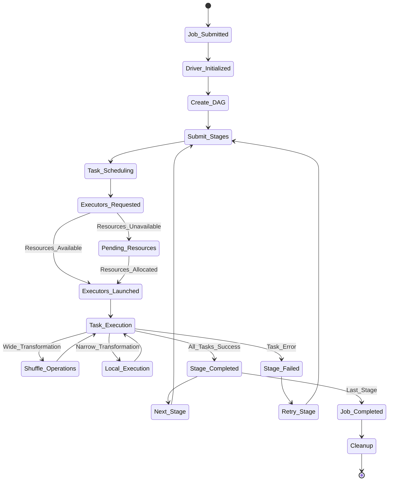

```mermaid
stateDiagram-v2
    [*] --> Job_Submitted

    Job_Submitted --> Driver_Initialized
    Driver_Initialized --> Create_DAG
    Create_DAG --> Submit_Stages

    Submit_Stages --> Task_Scheduling
    Task_Scheduling --> Executors_Requested

    Executors_Requested --> Executors_Launched : Resources_Available
    Executors_Requested --> Pending_Resources : Resources_Unavailable

    Pending_Resources --> Executors_Launched : Resources_Allocated

    Executors_Launched --> Task_Execution
    Task_Execution --> Shuffle_Operations : Wide_Transformation
    Task_Execution --> Local_Execution : Narrow_Transformation

    Shuffle_Operations --> Task_Execution
    Local_Execution --> Task_Execution

    Task_Execution --> Stage_Completed : All_Tasks_Success
    Task_Execution --> Stage_Failed : Task_Error

    Stage_Completed --> Next_Stage
    Next_Stage --> Submit_Stages

    Stage_Failed --> Retry_Stage
    Retry_Stage --> Submit_Stages

    Stage_Completed --> Job_Completed : Last_Stage
    Job_Completed --> Cleanup
    Cleanup --> [*]
```
