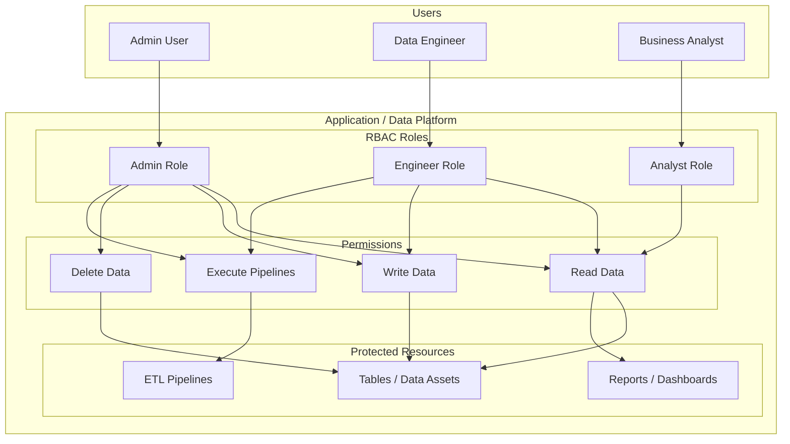

```mermaid
flowchart TB

    %% SYSTEM LEVEL (C4 Context)
    subgraph System[Application / Data Platform]
        direction TB

        subgraph Roles[RBAC Roles]
            Admin_Role[Admin Role]
            Engineer_Role[Engineer Role]
            Analyst_Role[Analyst Role]
        end

        subgraph Permissions[Permissions]
            Read_Permission[Read Data]
            Write_Permission[Write Data]
            Delete_Permission[Delete Data]
            Execute_Permission[Execute Pipelines]
        end

        subgraph Resources[Protected Resources]
            Tables[Tables / Data Assets]
            Pipelines[ETL Pipelines]
            Reports[Reports / Dashboards]
        end
    end

    %% USERS (C4 People)
    subgraph Users[Users]
        Admin_User[Admin User]
        Engineer_User[Data Engineer]
        Analyst_User[Business Analyst]
    end

    %% USER → ROLE
    Admin_User --> Admin_Role
    Engineer_User --> Engineer_Role
    Analyst_User --> Analyst_Role

    %% ROLE → PERMISSIONS
    Admin_Role --> Read_Permission
    Admin_Role --> Write_Permission
    Admin_Role --> Delete_Permission
    Admin_Role --> Execute_Permission

    Engineer_Role --> Read_Permission
    Engineer_Role --> Write_Permission
    Engineer_Role --> Execute_Permission

    Analyst_Role --> Read_Permission

    %% PERMISSIONS → RESOURCES
    Read_Permission --> Tables
    Write_Permission --> Tables
    Delete_Permission --> Tables

    Execute_Permission --> Pipelines
    Read_Permission --> Reports
```
