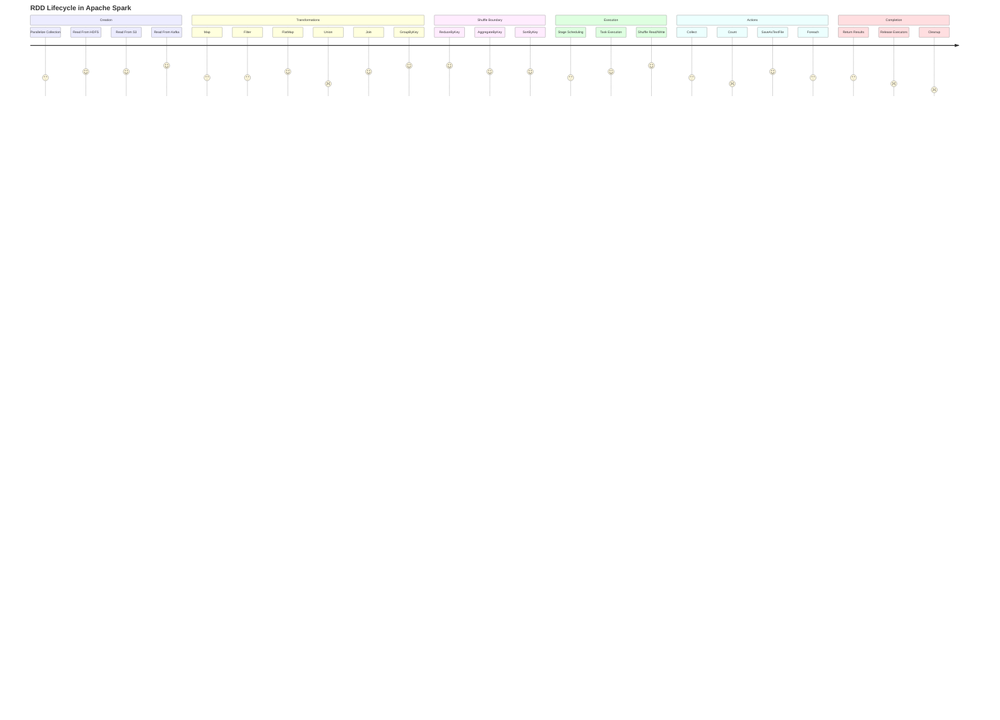

```mermaid
journey
    title RDD Lifecycle in Apache Spark

    section Creation
      Parallelize Collection: 3
      Read From HDFS: 4
      Read From S3: 4
      Read From Kafka: 5

    section Transformations
      Map: 3
      Filter: 3
      FlatMap: 4
      Union: 2
      Join: 4
      GroupByKey: 5

    section Shuffle Boundary
      ReduceByKey: 5
      AggregateByKey: 4
      SortByKey: 4

    section Execution
      Stage Scheduling: 3
      Task Execution: 4
      Shuffle Read/Write: 5

    section Actions
      Collect: 3
      Count: 2
      SaveAsTextFile: 4
      Foreach: 3

    section Completion
      Return Results: 3
      Release Executors: 2
      Cleanup: 1
```
