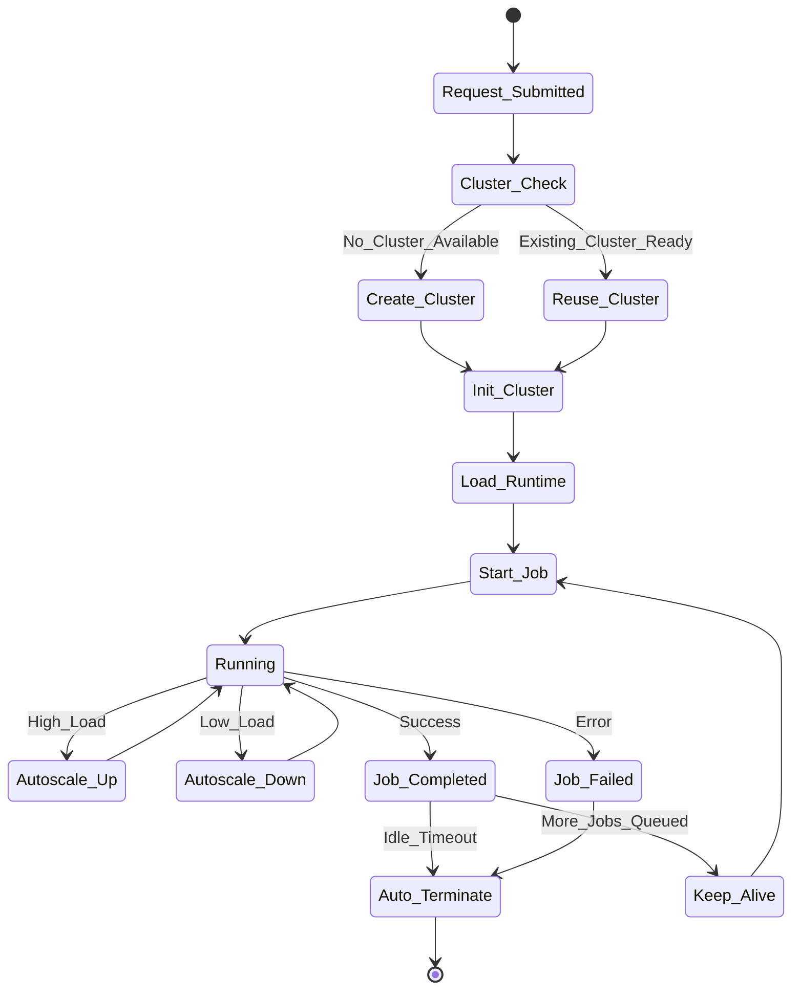

```mermaid
stateDiagram-v2
    [*] --> Request_Submitted

    Request_Submitted --> Cluster_Check
    Cluster_Check --> Create_Cluster : No_Cluster_Available
    Cluster_Check --> Reuse_Cluster : Existing_Cluster_Ready

    Create_Cluster --> Init_Cluster
    Reuse_Cluster --> Init_Cluster

    Init_Cluster --> Load_Runtime
    Load_Runtime --> Start_Job

    Start_Job --> Running
    Running --> Autoscale_Up : High_Load
    Running --> Autoscale_Down : Low_Load

    Autoscale_Up --> Running
    Autoscale_Down --> Running

    Running --> Job_Completed : Success
    Running --> Job_Failed : Error

    Job_Completed --> Auto_Terminate : Idle_Timeout
    Job_Completed --> Keep_Alive : More_Jobs_Queued

    Job_Failed --> Auto_Terminate

    Auto_Terminate --> [*]
    Keep_Alive --> Start_Job
```
