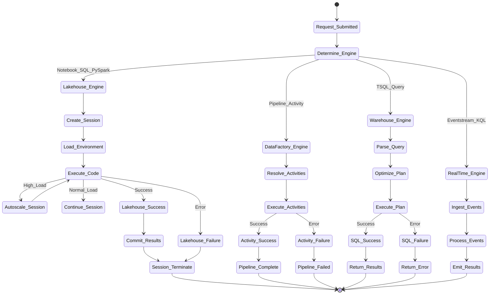

```mermaid
stateDiagram-v2
    [*] --> Request_Submitted

    Request_Submitted --> Determine_Engine
    Determine_Engine --> Lakehouse_Engine : Notebook_SQL_PySpark
    Determine_Engine --> DataFactory_Engine : Pipeline_Activity
    Determine_Engine --> Warehouse_Engine : TSQL_Query
    Determine_Engine --> RealTime_Engine : Eventstream_KQL

    %% Lakehouse Path (Spark)
    Lakehouse_Engine --> Create_Session
    Create_Session --> Load_Environment
    Load_Environment --> Execute_Code
    Execute_Code --> Autoscale_Session : High_Load
    Execute_Code --> Continue_Session : Normal_Load
    Autoscale_Session --> Execute_Code

    Execute_Code --> Lakehouse_Success : Success
    Execute_Code --> Lakehouse_Failure : Error

    Lakehouse_Success --> Commit_Results
    Commit_Results --> Session_Terminate
    Lakehouse_Failure --> Session_Terminate

    %% Data Factory Path (Pipelines)
    DataFactory_Engine --> Resolve_Activities
    Resolve_Activities --> Execute_Activities
    Execute_Activities --> Activity_Success : Success
    Execute_Activities --> Activity_Failure : Error

    Activity_Success --> Pipeline_Complete
    Activity_Failure --> Pipeline_Failed

    %% Warehouse Path (SQL)
    Warehouse_Engine --> Parse_Query
    Parse_Query --> Optimize_Plan
    Optimize_Plan --> Execute_Plan
    Execute_Plan --> SQL_Success : Success
    Execute_Plan --> SQL_Failure : Error

    SQL_Success --> Return_Results
    SQL_Failure --> Return_Error

    %% Real-Time Path (KQL)
    RealTime_Engine --> Ingest_Events
    Ingest_Events --> Process_Events
    Process_Events --> Emit_Results

    %% Final States
    Session_Terminate --> [*]
    Pipeline_Complete --> [*]
    Pipeline_Failed --> [*]
    Return_Results --> [*]
    Return_Error --> [*]
    Emit_Results --> [*]
```
